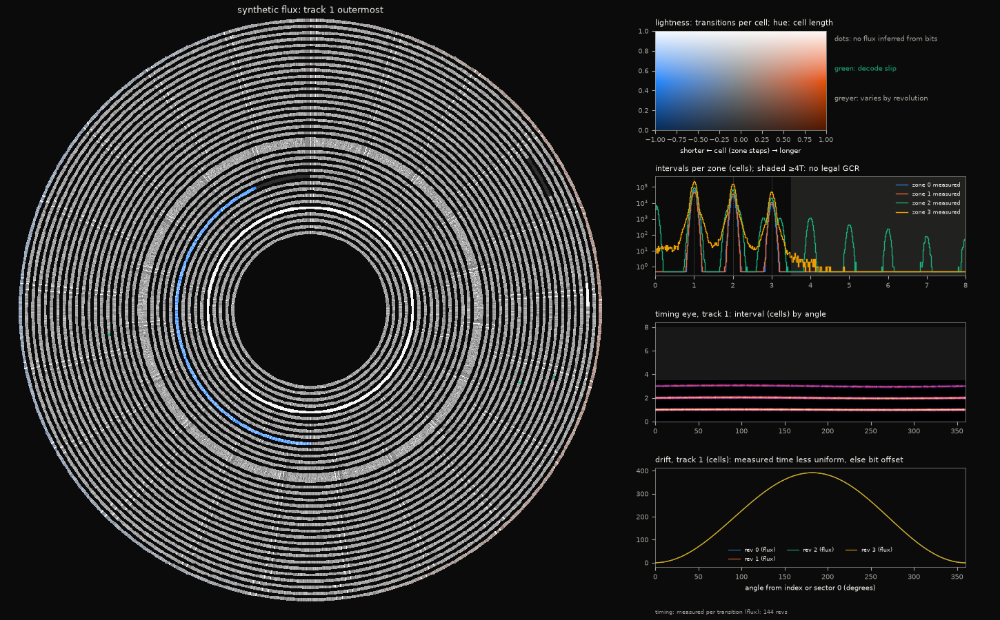

# nybulah

Raw-track ("nibbler") imaging and writing for Commodore 1541 and 1571 disk
drives, and WD177x-level imaging and writing for the 1581, over the standard
serial IEC bus, through OpenCBM and a ZoomFloppy or
another xum1541 adapter. No parallel cable is needed. It is for preserving
copy-protected and non-standard disks and writing them back.

> Status: early development. Transports, drive code and analysis are tested
> against a cycle-stepped 1541/1571 simulator; hardware testing is ongoing.

## Features

- **Transports.** Drive-resident 6502 code over the stock S1/S2 protocols
  or, with the modified xum1541 firmware, over X and SRQ with a 16-bit block
  check and retry ([protocol.md](docs/protocol.md)):

  | transport | lines | firmware | drives |
  |---|---|---|---|
  | s1, s2 | stock serial (s2 strobes ATN: one drive on the bus) | any | 1541, 1571 |
  | s3 | X: CLK/DATA only, burst X (one handshake per 64 bytes) with v10 | v9, v10 | 1541, 1571 |
  | s4 | 1571 CIA shift register on SRQ | v11 (v12 streams) | 1571 |

  Watchdogs on the drive, in the firmware and on the host return everything
  to a usable state after a stall, without power cycling. Other drives can
  stay powered on the bus except under s2.
- **Raw capture.** On a 1541, and for writes and RAM capture passes on a 1571,
  the drive captures a track into an 8 KB RAM expansion (found automatically)
  and the host fetches it. A 1571 with firmware v12 streams whole revolutions
  in real time through s4 with no RAM expansion, so D64/D71 reads need none.
- **Telemetry.** Sync lengths from per-byte arrival times, each within
  per-sync bounds and within ±1 bit for 99.95% of syncs in simulation; no byte
  is lost for any sync length. Revolution time from the 1571 index sensor or
  the track's own repetition ([disk.md](docs/disk.md#capture-passes)).
- **Head location without bumping.** A 1541 is located from sector headers
  or DOS's track (bumping needs `--allow-bump`). A 1571 is homed on its
  track 00 sensor by the DOS rule and is never bumped
  ([disk.md](docs/disk.md#head-location)).
- **Disk operations.** Read D64 on both drives and D71 on a 1571, with error
  bytes and retries that merge the best read of each sector. Write D64/D71,
  verifying every track by re-capture. `--archive` keeps every raw capture so
  images can be re-derived.
- **Analysis.** Vectorised GCR codec; sector decode with D64 error codes;
  revolution detection with a significance test (segment shifts checked
  against sector headers for byte-ready captures, FFT autocorrelation for
  continuous streams); killer and unformatted track classes; index alignment;
  GCR fault classification ([analysis.md](docs/analysis.md)).
- **Disk map.** Every revolution of every track classified against clean-DOS
  statistics, with stable, weak and capture-fault regions told apart
  ([analysis.md](docs/analysis.md#disk-map)).
- **Flux view.** The disk as an image of its flux: transitions per cell as
  lightness, cell length as hue, revolution-to-revolution variance as lost
  colour, inferred no-flux as dots; interval histograms, timing eye and drift;
  per-revolution APNG and a zoomable HTML viewer down to single transitions
  ([analysis.md](docs/analysis.md#flux-view)).
- **1581.** ID lists with timing, sector reads with status, Read Track, and
  Write Track/Write Sector, streamed through the 8520 shift register (s4,
  firmware v12) or through the track cache RAM; an MFM layer decodes marks,
  CRCs and layouts and maps CRC errors, deleted data, odd sizes, duplicate or
  missing IDs and unstable bytes
  ([protocol.md](docs/protocol.md#1581-capture-and-streaming-drivemfms-drivemfmstreams)).
  The head is homed by a WD Restore bounded to the estimated cylinder and
  confirmed by TR00.
- **Formats.** Read and write NIB, NB2, NBZ, G64, G71, P64, SCP, KryoFlux,
  D64 and D81 (1581 captures also export to IMD); flux decoded through a 1541
  read-circuit model; conversion to G64, G71, D64 and P64 keeps every track
  ([formats.md](docs/formats.md)).

Measured transfer rates, ZoomFloppy, 8 KB blocks, bytes/s read / write
([hardware.md](docs/hardware.md#expected-results)):

| transport | firmware | 1541-II | 1571 1 MHz | 1571 2 MHz |
|---|---|---|---|---|
| s1 | any | 1634 / 1493 | 1669 / 1498 | |
| s3 (X) | v9 | 9102 / 8278 | 9105 / 8277 | 18176 / 16523 |
| s3 (burst X) | v10 | 14263 / 18158 | 14271 / 18153 | 28300 / 35877 |
| s4 | v12 | | 23420 / 22261 | 46372 / 37052 |

## Compared with existing tools

| | nybulah | nibtools | OpenCBM d64copy/cbmcopy | Flux boards (KryoFlux, Greaseweazle, SCP) |
|---|---|---|---|---|
| Raw tracks from a 1541 | serial IEC + 8 KB RAM expansion | parallel cable required | no (sectors only) | flux, with a PC drive or modified hardware |
| Raw tracks from a 1571 | serial IEC: SRQ streaming (firmware v12) or 8 KB RAM expansion | SRQ or parallel | no | flux |
| Other drives powered on the bus | yes | depends on transport | with S1 or original transfer | n/a |
| Recovers from stalls without power cycling | yes (firmware v9+) | no | no | n/a |
| Sync lengths | per-byte arrival times, bounded per sync | no | no | yes |
| Index alignment and RPM on a stock 1571 | WD1770 index sensor | needs an SC+-style sensor mod | no | yes |
| Revolution detection | significance-tested, checked against sector headers | byte matching within a fixed window | n/a | tool-dependent |
| Licence | Apache-2.0 | GPL-3.0 | GPL-2.0 | various |

## Requirements

- A ZoomFloppy or another xum1541 adapter. Stock firmware runs s1/s2. The
  fork at [anarkiwi/OpenCBM](https://github.com/anarkiwi/OpenCBM) adds
  stall recovery and X (v9), burst X (v10), s4 (v11) and streaming (v12,
  branch `xum1541-stream`, which the Docker image's plugin is built from).
  Flashing: [hardware.md](docs/hardware.md#flashing-the-zoomfloppy-firmware).
- A 1541 or 1571. Raw captures on a 1541, and writes and RAM capture passes
  on a 1571, need an 8 KB RAM expansion (`$8000-$9FFF` on a 1541,
  `$6000-$7FFF` on a 1571). A 1571 with firmware v12 reads D64/D71 without it.
- A 1581 needs no modification (any DOS ROM, JiffyDOS included).
- Docker. The image bundles OpenCBM, the assembled drive code and Python.

## Usage

```sh
docker build --target runtime -t nybulah .
alias nybulah='docker run --rm --stop-timeout 34 --device=/dev/bus/usb -v "$PWD:/data" nybulah'

nybulah bus reset "wait 8 9 10"           # reset; wait until every drive has settled
nybulah hwcheck --devs 8 10 --proto s3     # identify drives, probe RAM, bench transports
nybulah read --dev 10 --transport s3 disk.d64   # 1541: read with error bytes
nybulah read --dev 8 --transport s4 disk.d71    # 1571: both sides, streamed with v12
nybulah write --dev 8 --transport s4 disk.d71   # format, write, verify every track
nybulah read --dev 9 --transport s4 disk.d81    # 1581: D81 with error bytes
nybulah info disk.g64                      # per-track kind, cycle, errors (--map: text map)
nybulah convert disk.nbz disk.g64          # to .g64, .g71, .d64 or .p64
nybulah map disk.nib -o disk.html          # .png disk, .apng animation, .svg/.html strip
nybulah survey CORPUS --out survey/        # corpus statistics and thresholds
```


*Disk map of a synthetic disk (`tools/diskmap_example.py`), stepping through
four revolutions: grey is standard DOS content; hatched regions change between
revolutions; outlines are capture faults ([static view](docs/img/diskmap.png)).*



*Flux view of a synthetic flux image (`tools/diskmap_example.py`): a speed
wobble on track 1, a long sync, a no-flux gap, a half-written faster zone
(blue), a killer track (white), crosstalk on half track 20.5.*

```sh
nybulah flux disk.scp -o disk.html  # .png disk with panels, .apng by revolution, .html viewer
```

Hardware probes: `homeprobe` (1571 track 00 sensor and homing plan),
`streamprobe` (one streamed track), `ramcheck` (RAM captures against a
stream), `ramprobe` and `bench`. `nybulah <command> --help` lists the options.

## Documentation

- [docs/hardware.md](docs/hardware.md): bus sessions, hardware check, probes,
  firmware flashing and measured rates
- [docs/protocol.md](docs/protocol.md): X, burst X, SRQ and streaming wire
  protocols, timing and margins
- [docs/disk.md](docs/disk.md): drive routines, capture passes, D64/D71
  reading and writing, head location; 1581 in
  [hardware.md](docs/hardware.md#1581)
- [docs/analysis.md](docs/analysis.md): GCR, revolution detection, faults,
  disk map and format APIs
- [docs/formats.md](docs/formats.md): image formats, flux decoding and
  licences
- [docs/scenarios.md](docs/scenarios.md): track scenarios in preserved
  images, corpus statistics and how nybulah handles each

## Development

```sh
docker build --target test -t nybulah:test .
docker run --rm -v "$PWD:/app" -w /app nybulah:test python -m pytest -n auto
```

The drive code is ca65 assembly in `drive/`, assembled in the Docker build.
Tests run it on a compiled drive simulator (`nybulah.simfast`);
`NYBULAH_SIM=py65` selects the py65 reference model it is checked against.

## Licence

Apache-2.0. nybulah contains no nibtools or OpenCBM code. The modified
firmware lives in its own GPL-2.0 repository.
