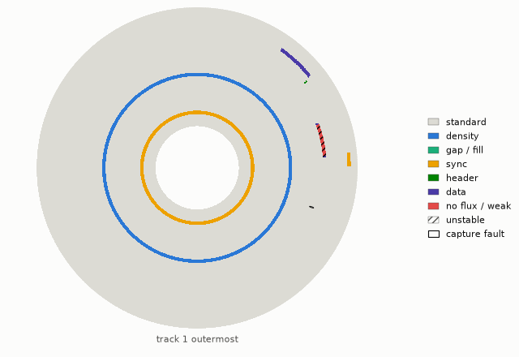

# nybulah

Raw-track ("nibbler") imaging and writing for Commodore 1541 and 1571 drives,
and WD177x-level imaging and writing for the 1581, over the serial IEC bus
through OpenCBM and a ZoomFloppy or another xum1541 adapter. No parallel
cable is needed. It preserves copy-protected and non-standard disks and
writes them back.

> Status: early development; hardware testing is ongoing.

## Support

| drive | `read` | `write` | needs |
|---|---|---|---|
| 1541 | D64 from raw GCR captures | D64 | 8 KB RAM expansion at `$8000-$9FFF` |
| 1571 | D64, D71 (streamed with firmware v12) | D64, D71 | 8 KB RAM expansion at `$6000-$7FFF` for writes and RAM passes |
| 1581 | D81 | D81 | nothing (any DOS ROM) |

`--archive DIR` keeps every raw capture (GCR, sync lengths, byte times, or
1581 track data) so images can be re-derived
([disk.md](docs/disk.md)). Raw-track writing is a library API
(`nybulah.nibbler`).

Image formats (`info`, `convert`, `map`, `flux`): NIB, NB2, NBZ, G64, G71,
P64, SCP, KryoFlux, D64, D71, D81, IMD ([formats.md](docs/formats.md)).

## Install

Requires Docker and a ZoomFloppy or another xum1541. Stock firmware runs the
s1/s2 transports; the fork at
[anarkiwi/OpenCBM](https://github.com/anarkiwi/OpenCBM) adds the faster
transports and stall recovery
([flashing](docs/hardware.md#flashing-the-zoomfloppy-firmware)).

```sh
docker build --target runtime -t nybulah .
alias nybulah='docker run --rm --stop-timeout 34 --device=/dev/bus/usb -v "$PWD:/data" nybulah'
```

## Usage

```sh
nybulah bus reset "wait 8 9 10"                 # reset; wait until every drive has settled
nybulah hwcheck --devs 8 10 --proto s3          # identify drives, probe RAM, bench transports
nybulah read --dev 10 --transport s3 disk.d64   # 1541: read with error bytes
nybulah read --dev 8 --transport s4 disk.d71    # 1571: both sides, streamed
nybulah write --dev 8 --transport s4 disk.d71   # format, write, verify every track
nybulah read --dev 9 --transport s4 disk.d81    # 1581: D81 with error bytes
nybulah info disk.g64                           # per-track kind, cycle, errors
nybulah convert disk.nbz disk.g64               # to .g64, .g71, .d64 or .p64
nybulah map disk.nib -o disk.html               # disk map: .png, .apng, .svg/.html
nybulah flux disk.scp -o disk.html              # flux view: .png, .apng, .html
nybulah survey CORPUS --out survey/             # corpus statistics and thresholds
```

`nybulah <command> --help` lists the options.



## Documentation

- [features.md](docs/features.md): transports, capture, analysis and format features
- [hardware.md](docs/hardware.md): bus sessions, hardware check, probes, firmware, transfer rates
- [protocol.md](docs/protocol.md): X, burst X, SRQ and streaming wire protocols
- [disk.md](docs/disk.md): drive routines, capture passes, D64/D71 reading and writing, head location
- [analysis.md](docs/analysis.md): GCR, revolution detection, faults, disk map, flux view, MFM
- [formats.md](docs/formats.md): image formats, flux decoding, licences
- [scenarios.md](docs/scenarios.md): track scenarios in preserved images
- [comparison.md](docs/comparison.md): other tools, historic copiers, gaps

## Development

```sh
docker build --target test -t nybulah:test .
docker run --rm -v "$PWD:/app" -w /app nybulah:test python -m pytest -n auto
```

Drive code is ca65 assembly in `drive/`, run in tests on a compiled drive
simulator (`nybulah.simfast`; `NYBULAH_SIM=py65` selects the reference model).

## Licence

Apache-2.0. nybulah contains no nibtools or OpenCBM code; the modified
firmware is in its own GPL-2.0 repository.
